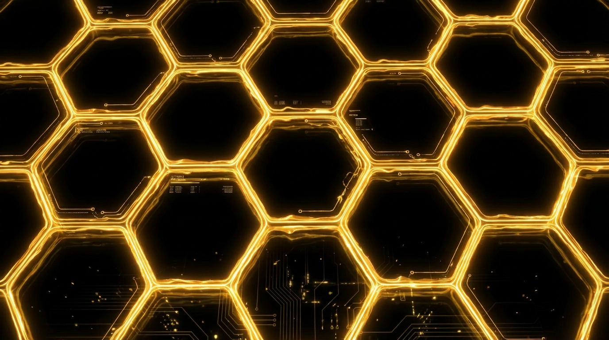
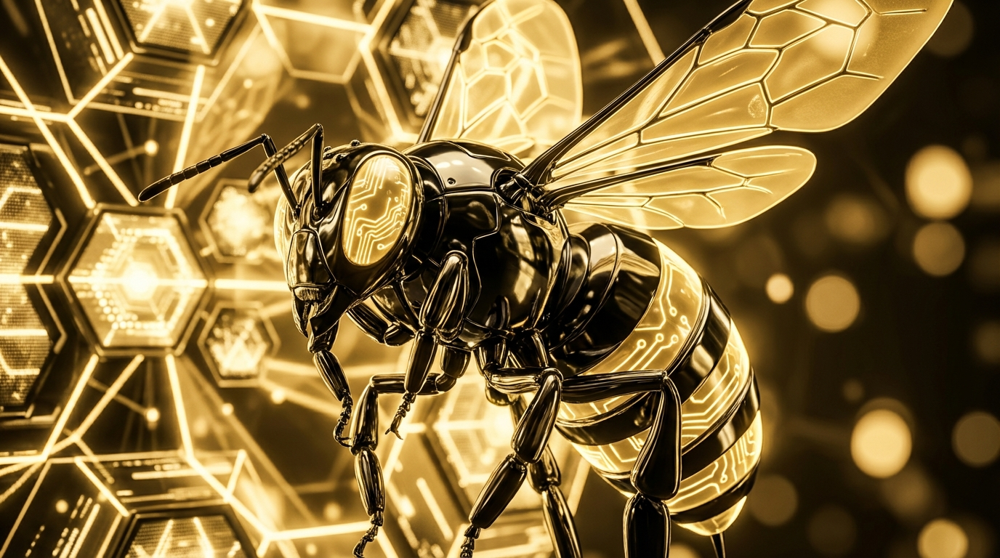
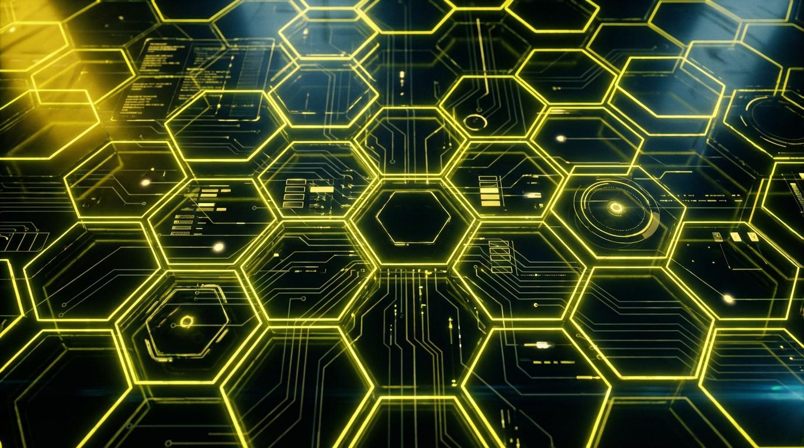
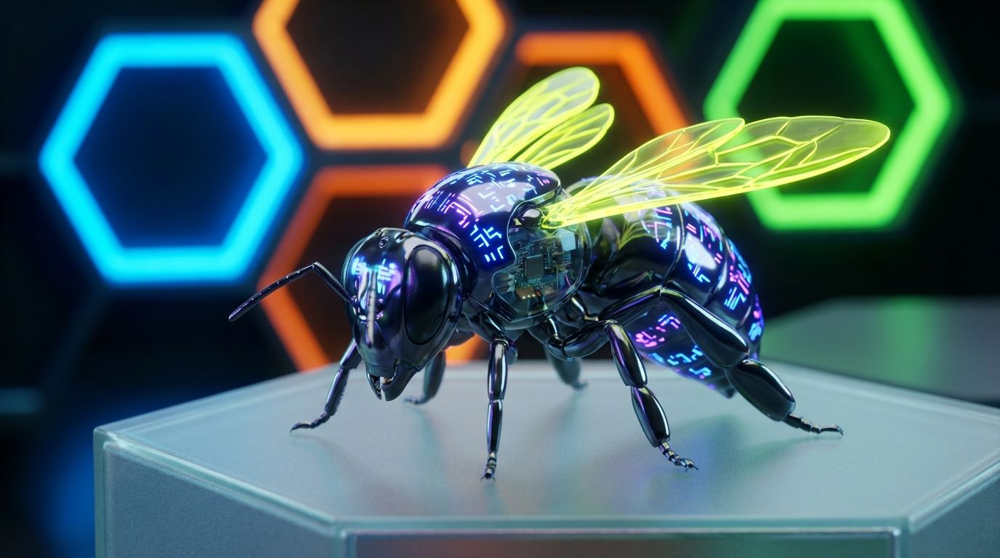

# 🐝 Bee-Hive SDDM Theme

> **HoneyDark glassmorphism login screen for Bee-Hive OS — powered by Qt5/Qt6, styled by the Nexus.**

A sleek SDDM login theme featuring an animated hexagonal grid, glassmorphism UI elements, and a left-aligned layout inspired by the Bee-Hive OS aesthetic.

---

## ✨ Key Features

- **Cyber Queen Nexus wallpaper** — background with signature Bee-Hive OS artwork
- **Animated hexagonal grid** — animated hex grid pulsing with the HoneyDark palette
- **Glassmorphism UI** — frosted login panel with configurable BeeAura blur
- **Functional session picker** — via `SddmComponents 2.0` native ComboBox (displays Hyprland, etc.)
- **Visible system icons** — Power Off ⏻, Restart ↺, Suspend ⏸ in honey yellow on dark background
- **Compact left-aligned panel** — 310px form on the left, bottom-right clock
- **Multi-media backgrounds** — static PNG, animated GIF, MP4/WebM video
- **Qt5/Qt6 polyglot** — compatible with both Qt5 and Qt6 SDDM builds

## 🎨 Visual Gallery

Choose your hive atmosphere from our collection of hand-crafted masterpieces:

| **Cyber Queen Nexus** (Default) | **Hexa-Neon Honey** |
|:---:|:---:|
|  |  |
| *The flagship experience* | *Pure honey energy* |

| **Cyber-Bee Monochrome** | **Hexa-Neon Base** | **Cyber-Bee Base** |
|:---:|:---:|:---:|
|  |  |  |
| *Sleek & minimal* | *Neutral tech* | *The robotic essence* |

---

## 📦 Dependencies

> **CRITICAL for Arch / CachyOS users** — these packages are required.

```bash
sudo pacman -S qt5-quickcontrols2 qt5-graphicaleffects qt5-multimedia sddm
```

| Package | Purpose |
|---|---|
| `qt5-quickcontrols2` | `QtQuick.Controls 2` |
| `qt5-graphicaleffects` | Blur and glow effects |
| `qt5-multimedia` | GIF / video background |
| `sddm` | Provides `SddmComponents 2.0` (ComboBox session) |

---

## 🚀 Installation

**1. Clone the theme:**

```bash
git clone https://github.com/marcchabot/beehive-sddm ~/beehive-sddm
sudo cp -r ~/beehive-sddm /usr/share/sddm/themes/beehive
```

**2. Enable in `/etc/sddm.conf`:**

```ini
[Theme]
Current=beehive
```

**3. Test without restarting:**

```bash
sddm-greeter --test-mode --theme /usr/share/sddm/themes/beehive
```

**4. Update:**

```bash
cd ~/beehive-sddm && git pull
sudo cp -f ~/beehive-sddm/Main.qml /usr/share/sddm/themes/beehive/Main.qml
```

---

## ⚙️ Configuration

Edit `theme.conf`:

```ini
[General]
# Type: "image" | "gif" | "video"
background_type=image
background=assets/cyber_queen_nexus.png
# BeeAura blur: 0.0 (none) → 1.0 (max)
blur_radius=0.18
```

### Available backgrounds

| File | Style |
|---|---|
| `assets/cyber_queen_nexus.png` | **Default** — Cyber Queen |
| `assets/hexa_neon_honey.png` | Hexa-Neon honey gold |
| `assets/cyber_bee_monochrome.png` | Cyber-Bee monochrome |
| `assets/hexa_neon_base.png` | Neutral hex |
| `assets/cyber_bee_base.png` | Neutral cyber |

---

## 🗂️ Structure

```
beehive_sddm/
├── Main.qml            # Main theme script
├── metadata.desktop    # SDDM metadata
├── theme.conf          # Configurable options
└── assets/
    ├── cyber_queen_nexus.png
    ├── hexa_neon_honey.png
    ├── cyber_bee_monochrome.png
    ├── hexa_neon_base.png
    └── cyber_bee_base.png
```

---

## 📋 Changelog

| Version | Notes |
|---|---|
| **v0.2.6** | Fix QML structure (ComboBox properly positioned) |
| **v0.2.5** | `import SddmComponents 2.0` — functional session picker |
| **v0.1.8** | System icons in honey yellow, white labels |
| **v0.1.6** | Compact layout, bottom-right clock, centered fields |

---

## 🐝 Crédits

- **Authors:** Maya 🐝 & Marc
- **License:** GPL-3.0

*Part of the Bee-Hive OS ecosystem. The hive never sleeps.* 🍯
